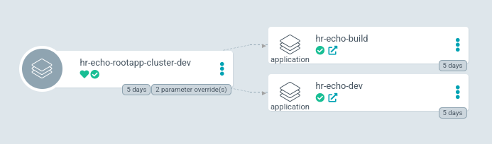
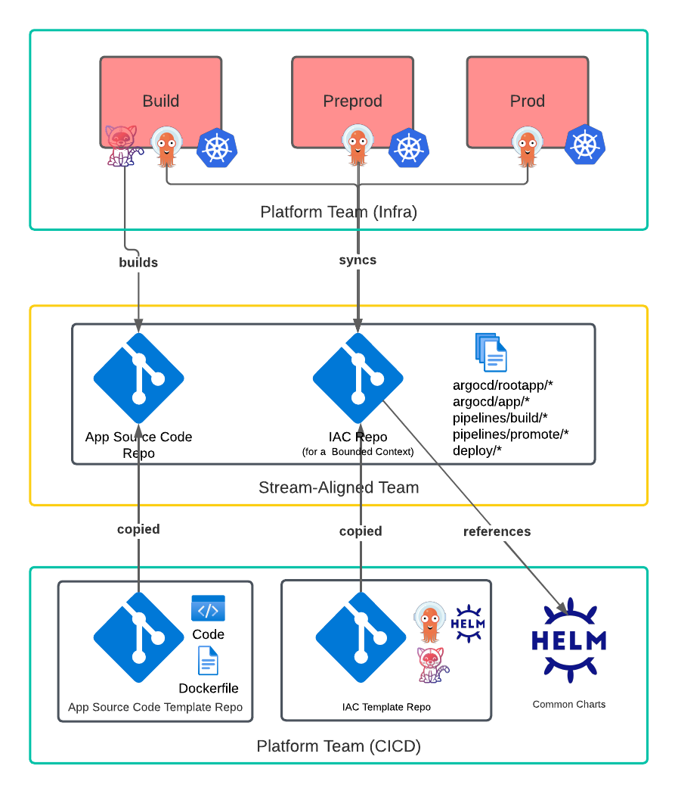
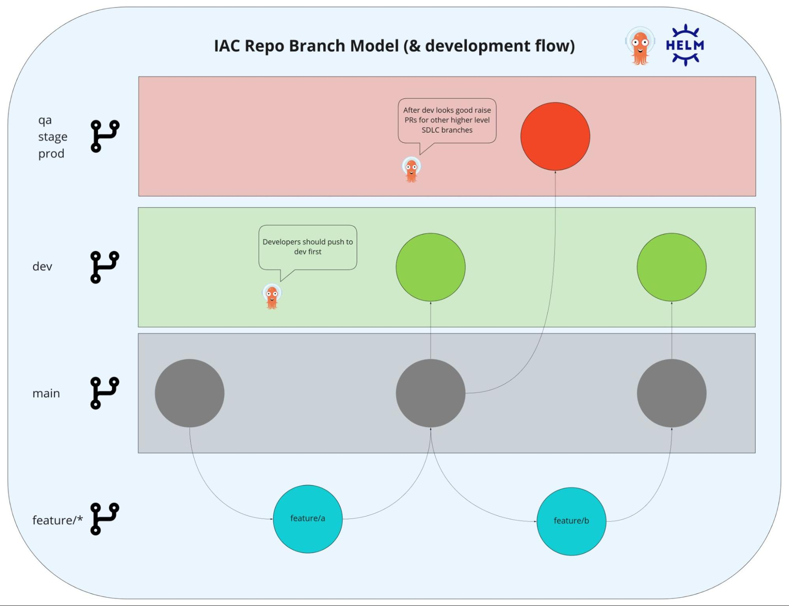

# platform-design-and-adoption

Considerations for container platforms and their adoption.

## Contents

1. [Intro](#intro)
2. [Platform Services](#platform-services)
3. [Team Structure & Dynamics](#team-structure--dynamics)
4. [Container Development](#container-development)
5. [Pipelines](#pipelines)
6. [GitOps](#gitops)
7. [Service Mesh](#service-mesh)
8. [Appendix](#appendix)

## Intro

Creating a modern platform for building, running and managing applications comes with a plethora of design decisions and component choices. It can be daunting and, frankly, hard to imagine where to start.

This document offers some opinionated answers and common practices to questions typically asked by [Platform teams](https://teamtopologies.com/key-concepts) and [Stream-aligned teams](https://teamtopologies.com/key-concepts) (application development teams) when planning a platform for the enterprise. We will focus on container platforms using OpenShift/Kubernetes and also provide a perspective for stream-aligned teams to follow for adoption of the platform using common practices. To begin, both platform and stream-aligned teams should have clearly defined the platform services available, as well as their organizational structure and team relationships. Platform teams can then create standardized patterns for building and running applications.

An [enabling or platform team](https://teamtopologies.com/key-concepts) tasked with onboarding new stream-aligned teams to build and run containerized services may be inclined to directly fork this document and add their own enterprise/implementation-specific information for onboarding documentation, however the final onboarding documentation should be maintained by a long-lived platform team.

## Platform Services

The following are a list of platform services that should be consumable by [stream-aligned](https://teamtopologies.com/key-concepts) (development) teams. These are topics that should be discussed and planned upon prior to onboarding teams.

### Runtime

* The container management distribution of choice, for example Kuberenetes or OpenShift
* Typically there is more than one cluster, namely a “production” dedicated cluster and one or more clusters for development and testing. There may also be short lived sandbox clusters useful for testing upgrades of the platform by the platform team or training
* Examples:
  * OpenShift
  * Kubernetes

### Source Code Management

* Git has become the de facto source code management solution. You need to use Git, there really isn’t any other option that works well with most tools.
* Responsible for all Infrastructure as Code as well as Application source code
* Examples:
  * GitHub
  * GitLab
  * Bitbucket

### Multi-Tenancy Processes (platform onboarding)

#### Openshift Users and Groups

* Typically, organizations rely on a centralized Identity and access management provider, ie Active Directory or LDAP, for role based access control to various tools in an organization.
* OpenShift/Kubernetes should periodically reconcile Users and Groups (with mappings to Users) from an Identity Provider or an Infrastructure as Code (IAC) repository responsible for syncing those objects.
* A separate, self-service, process should exist within the organization for the creation and maintenance of Groups within the Identity Provider. For example, this could be a ServiceNow ticket approach for developers to request Active Directory group access or a pull request, review and GitOps sync process from an Infrastructure as Code (IAC) repository.

#### Group Naming Convention

* One strategy for denoting a Group to a Namespace and Role (view, edit, admin) relationship is simply a naming convention for Groups, for example:
  * openshift-&lt;namespace>-&lt;role>

  In the spirit of least privilege access, it may make sense to deploy [bounded contexts](https://www.martinfowler.com/bliki/BoundedContext.html#:~:text=domain%20driven%20design,being%20explicit%20about%20their%20interrelationships.)/applications into separate Namespaces, since RBAC in OpenShift/Kubernetes is controlled at the Namespace level. This ensures that developers in large teams/portfolios may be granted access to maintain only the components required of them. With this in mind, the “&lt;namespace>” in our example Group syntax above might need to evolve to a more specific naming convention with the organization/business unit/portfolio, bounded context and environment names that make up the “&lt;namespace>” name. For example, the Group naming convention may become:
  * openshift-&lt;org>-&lt;context>-&lt;env>-&lt;role>

#### Namespace/Environment Provisioning and Maintenance

* Many kinds of namespaces may exist; for example:
  * SDLC, or semi-static namespaces bound to the application lifecycle environment for example dev, qa, prod
  * Build namespaces dedicated to ci/cd processes for applications
  * Personal or sandbox namespaces for temporary use/experimentation
  * Feature branch namespaces typically provisioned based on GitFlow feature branch workflows
* An automated reconciliation process should exist for the creation and maintenance of Namespaces, especially in clusters that should be more “production-like” and stable. It may be as simple as a Git Infrastructure as Code (IAC) pull request process which then automatically syncs to clusters using GitOps.
* The Namespace naming convention should complement the Group Naming Convention
  * For example: &lt;org>-&lt;context>-&lt;env>
* It's also possible to use various operators, such as the [namespace-configuration-operator](https://github.com/redhat-cop/namespace-configuration-operator) to automate Namespace maintenance based on Group annotations/labels; see [Orgs Management and Team Onboarding in OpenShift: A Fully Automated Approach](https://cloud.redhat.com/blog/orgs-management-and-team-onboarding-in-openshift-a-fully-automated-approach).
* The Namespace maintenance process should allow for:
  * Adding/removing Namespaces
  * Image pull secret configuration (a secrets management solution is useful here, see below)
  * Namespace Quota changes (t-shirt sizes)
    * Quotas are important for limiting and sizing the expected maximum amount of resources required in a cluster. A cluster-admin should come up with a general baseline of available cluster Nodes to match the cumulative Quotas among all namespaces (or implement node autoscaling strategies). As such, a general quota “t-shirt size” option may be helpful when planning for namespace creation, such as small, medium, and large.
    * A good practice is to only have “hard resources requests” for cpu and memory (not resource limits) in ResourceQuotas. However, ephemeral storage should have both requests and limits. Although not required by the quota, applications should still consider using resource limits for memory since this is not “[compressible](https://kubernetes.io/blog/2021/11/26/qos-memory-resources/)”. See [How Full is My Cluster - Part 2: Protecting the Nodes](https://cloud.redhat.com/blog/full-cluster-part-2-protecting-nodes) for more explanation. For example:

      ```yaml
      kind: ResourceQuota
      apiVersion: v1
      metadata:
        name: small
      spec:
        hard:
          requests.cpu: '2'   
          requests.memory: 4Gi
          limits.ephemeral-storage: 10Gi
          requests.ephemeral-storage: 10Gi
      ```

    * LimitRange changes. These typically should have default requests including cpu and memory since we require them in the ResourceQuotas. It is also a good idea to enforce default ephemeral storage requests and limits to protect worker nodes from applications that should be using persistent storage instead. For example:

      ```yaml
      kind: LimitRange
      apiVersion: v1
      metadata:
        name: defaults
      spec:
        limits:
          - type: Container
            default:
              ephemeral-storage: 100Mi
            defaultRequest:
              cpu: 10m
              ephemeral-storage: 100Mi
              memory: 64Mi
      ```

    * Namespace labels/annotation updates
    * Default Network Policies
      * For improved security, it is typical to isolate pod communication by denying all traffic except from pods within the same namespace or the ingress controller
      * Consider enforcing the [deny-by-default, allow-from-openshift-ingress, and allow-same-namespace](https://docs.openshift.com/container-platform/4.12/networking/network_policy/about-network-policy.html#nw-networkpolicy-about_about-network-policy) NetworkPolicies by default for tenant namespaces
    * RoleBindings
      * RoleBindings should be bound to the Groups created by the Identity Provider

### Image Registry

* This is one or more container image registries that kubernetes can pull from
* The CI process pushes built images to these registries
* This is typically external from the container platform
* Examples:
  * Quay
  * Artifactory
  * Nexus

### Base Images

* Define the base images that [stream-aligned](https://teamtopologies.com/key-concepts) teams should use to build and run applications on
* If your organization has strict requirements for vulnerability scanning/vetting of base images before they can be used by stream-aligned teams, define a process (ideally automated) for doing so
* Base images must be regularly updated and maintained to fix vulnerabilities
* If a vendor provides provides regularly updated base images, try and push development teams to use those
* CI/CD processes should strive towards for automated builds and deployments when base images are updated to automatically push vulnerability fixes
* Examples:
  * Red Hat UBI builder images

### Vulnerability Scanning

* A service and/or process should allow for artifact scanning
* Built images should be scanned and pass an acceptable threshold before being allowed to be consumable/runnable in a kubernetes environment
* Examples:
  * Red Hat Advanced Cluster Security
  * Anchore
  * Snyk

### Secrets Management

* A centralized, often external, secrets management solution is ideal so that no unencrypted secrets end up in Infrastructure as Code
* Encrypting secrets in git repositories is another option using tools like Ansible Vault or Bitnami SealedSecrets operator
* Examples:
  * Hashicorp Vault
  * Cyberark Conjur
  * Bitnami SealedSecrets Operator
  * Ansible Vault

### Certificates Management

* This provides a self service approach for developers to easily mint workload certificates from Issuers
* Can automatically rotate expired certificates
* Examples:
  * Cert-manager Operator

### Monitoring/Alerting

* The platform needs to expose metrics. Alerts are then created from those metrics
* Should conform to SLO/SLI goals for SRE monitoring
* May include Error Budgets for SRE monitoring
* Application teams should also be able to define their own metrics and create alerts on them
* Examples:
  * OpenShift Monitoring
  * Prometheus Operator
  * Dynatrace
  * AppDynamics

### Synthetic Monitoring

* This provides a means of probing applications as an end user to prove the entire network flow (some situations may require this to proactively monitor services; especially when those services are seldom used or metrics are not available to scrape from the service)
* Can be brittle since you need to create a synthetic user. Typically, the synthetic user should also only be able to monitor a read only endpoint.
* A better approach to synthetic monitoring may be to monitor transaction volume metrics for services that typically have traffic
* Should alert after a threshold is reached
* Examples:
  * Prometheus [blackbox-exporter](https://github.com/prometheus/blackbox_exporter) (Prometheus operator)
  * Dynatrace [Synthetic Monitoring](https://www.dynatrace.com/support/help/how-to-use-dynatrace/synthetic-monitoring)
  * Elastic [Heartbeat](https://www.elastic.co/beats/heartbeat)

### Incident Management Platform & Processes

* Provides a means of triaging alerts to the correct teams to action upon
* Includes SRE tenets such as blameless postmortems, instilling “mistakes” as opportunities to strengthen the system
* Examples:
  * Service Now
  * VictorOps

### Identity Provider

* Typically, applications should be authorizing requests and a standard platform-provided authentication and authorization provider is required
* The Identity provider should have a self service model for configuring new applications
* It should provide common patterns for authn/z of users, for example OIDC/OAuth2 and JWT tokens
* Some platform components may be able to use Openshift OAuth to authenticate
* Examples:
  * Keycloak
  * Okta

### Logging

* Provide a mechanism for collecting STDOUT and STDERR log output to a centralized area
* Logs must be searchable for both platform and application logs & events
* Typically fluentd collects the STDOUT and STDERR logs on worker nodes and forwards them elsewhere
* Examples:
  * OpenShift Logging
  * Splunk

### Storage

* Applications and services typically need some sort of persistence storage solution
* The requirements of the persistence determines the type of storage required
* Examples:
  * Red Hat Openshift Data Foundation
  * Cloud Provider Storage
  * NFS

### Compute

* Applications and services typically need compute to scale
* Consider using a Kubernetes Cluster Autoscaler
* Identify the type of compute workers needed and get upper-bound requirements of compute resources needed for different workloads from stream-aligned teams
* Examples:
  * Memory optimized machine types
  * CPU optimized machine types
  * GPU machine types

### Internal Networking

* A self service approach is needed for internal networking
* In Kubernetes, the OVN/SDN is provided and Services/Routes are definable by the developers
* Service Mesh can also unlock advanced internal networking capabilities

### Gateways

* These are typically API gateways that control edge traffic into the platform
* Examples:
  * OpenShift Service Mesh
  * Istio
  * 3Scale

### External Load Balancers

* Typically allows for unique VIPs and domains
* Provides a stable means of interacting with TCP services (databases)
* Examples:
  * Cloud provider k8s integrations (AWS, Azure, Google Cloud)

### Cluster Autoscaler & Scheduling

* Review the [kubernetes cluster autoscaler](https://github.com/kubernetes/autoscaler/tree/master/cluster-autoscaler) and address any use cases/requirements for autoscaling with stream-aligned teams
* It may be useful to automatically scale worker nodes with the cloud provider based on node groups/availability zones to achieve high availability of applications/components
* Having a clear understanding of what MachineSets will automatically scale and typical scenarios for autoscaling
* Depending on your use case, different [Kuberentes scheduler](https://kubernetes.io/docs/concepts/scheduling-eviction/kube-scheduler/) profiles/strategies can be used for scheduling pods for least or highest node utilization
* The “[descheduler](https://github.com/kubernetes-sigs/descheduler#removepodsviolatingtopologyspreadconstraint)” may be useful to evict pods for the [Kuberentes scheduler](https://kubernetes.io/docs/concepts/scheduling-eviction/kube-scheduler/) to then rebalance them
* If a cluster has large burstable workloads, the [proactive-node-scaling-operator](https://github.com/redhat-cop/proactive-node-scaling-operator) can be used to proactively scale nodes by scheduling low priority pods based on a definable user workload percentage

### CI - Pipelines

* The platform team would maintain the operator to allow [stream-aligned](https://teamtopologies.com/key-concepts) teams to provision their own pipelines.
* It is also possible for a central pipeline controller for many teams but maturity may be slow due to RBAC and cross team dependencies.
* Allow for an event-driven or push process
* Typically used for building images from Git commits and updating infrastructure as code which then deploys the application starting in lower environments
* Other push processes may exist for promoting applications to other environments but ideally this is completely automated. For example, after a successful automated test (started because of a Git commit) the test runner can update IaC which starts other chains of actions, perhaps all the way to production (this is hard to generalize since every application has different dependencies and requirements).
* Examples:
  * OpenShift Pipelines operator
  * Tekton operator
  * Jenkins

### CD - GitOps

* The platform team could maintain the operator to allow [stream-aligned](https://teamtopologies.com/key-concepts) teams to provision their own GitOps controllers.
* It is also possible for a central GitOps controller for many teams but maturity may be slow due to RBAC and cross team dependencies.
* This provides polling or pull process to sync Infrastructure as Code in Git repos with deployments configurations
* The [stream-aligned](https://teamtopologies.com/key-concepts) team should be able to consume and or create their deployment process, ideally using GitOps
* With GitOps properly configured, management of deployments is accomplished via pull/merge request processes
* Examples:
  * OpenShift GitOps operator
  * ArgoCD operator

### Governance

* Create policies for what should no longer be running in the k8s cluster
* Examples:
  * Red Hat Advances Cluster Security
  * Anchore
  * Open Policy Agent
  * Kyverno

## Team Structure & Dynamics

Clearly define what applications should run in which namespaces and who should have what level of access to them (roles). As mentioned in the Group Naming Convention section above, team structures should directly influence the platform’s multi-tenancy requirements regarding Namespace and Group naming conventions. In that example, the namespace naming convention proposed was &lt;org>-&lt;context>-&lt;env>. Let's dive in a bit further to what is meant by organization, context, and environment.

### Organization

This is a group of development teams that may work closely with one-another. An example of this might be a business unit name that many development teams “roll up” to or even a single Vice President. Typically, an organization produces the high level direction and goals for many different development teams.

### Bounded Context

A [bounded context](https://www.martinfowler.com/bliki/BoundedContext.html#:~:text=domain%20driven%20design,being%20explicit%20about%20their%20interrelationships.) may consist of many components/microservices. All components in a bounded context should be administered by a single [stream-aligned](https://teamtopologies.com/key-concepts) team. Ideally no “external team dependent” components are used, such as a shared database. Instead, the platform should allow for a self-service model of all commonly required components within a bounded context. For example, a developer should be able to provision an External Load Balancer, deploy the built source code of microservices, and create a database for a single bounded context.

### Environment

These denote segregated runtime networks which applications run in for the purpose of development, testing, and production as part of the Software Development Lifecycle (SDLC). Environments typically translate to multiple namespaces in the same OpenShift Cluster or the same Namespace name created in separate clusters.

### Role Assignment

Additionally, every development team should understand what level of access each member may be required to have in each environment. Consider the following RBAC for different team members.

|     |     |     |     |
| --- | --- | --- | --- |
| Dev Team Member Title | OCP Dev Cluster Role assignment | OCP QA/Test Cluster Role Assignment | OCP Prod Cluster Role Assignment |
| team lead/architecture owner | admin | admin | view |
| developer | admin | edit | view |
| tester | edit | view | view |
| other | view | view | view |

We typically want to restrict admin access to namespaces since that role allows the addition of new RoleBindings and viewing/editing of Secrets. Notice that the production cluster only has the view role allowed since this is typically meant to remain as stable as possible, only configurable via automation and IAC.

## Container Development

This section describes typical container development topics and common practices.

### The Twelve Factor App

Applications should be designed around the twelve factor application design principles to make them suitable for cloud platforms (there are many other good reasons, see [https://12factor.net/](https://12factor.net/)). Below are some Kubernetes-specific factors that should be considered when containerizing applications.

1. Codebase - “One codebase tracked in revision control, many deploys”
   * You really need to use Git, there is no other SCM with better integration in OpenShift/k8s
   * application source code and all Infrastructure as Code (IAC) is version controlled
   * Decide on an IAC templating/patching framework to use such as Helm or Kustomize (or both)
   * Combine IAC with GitOps practices and limit edit access in OpenShift/k8s clusters, especially in production clusters
2. Dependencies - “Explicitly declare and isolate dependencies”
   * This should be fairly straightforward but in addition to using package managers to build applications (for example Maven, npm, go modules, etc.) consider encapsulating the build process further using containers and multi-stage Docker builds
   * Always building from scratch may be slower, but ensures repeatability regardless of the build infrastructure. Some builds may need to be optimized using caching, but the cache should be populated and maintained by the application's build tool.
   * Never rely on system packages in the build system
3. Config- “Store config in the environment”
   * Properties (non-secret parameters used by applications) should be persisted as ConfigMaps and either read in as an external file mounted on the running container or [easily added to the environment variables](https://kubernetes.io/docs/tasks/configure-pod-container/configure-pod-configmap/#configure-all-key-value-pairs-in-a-configmap-as-container-environment-variables) of the running container as key-values pairs
   * Secrets (passwords/tokens/private keys) should be stored in k8s Secrets or loaded via a mechanism provided by a Secret Management tool. Typically the application needs to load secrets from a file or in-memory. Avoid adding secrets as environment variables since secrets might end up in logging implementations that show running processes
   * Never store plain text or encoded secrets in the codebase, remember k8s Secrets are just base64 encoded
4. Backing services - “Treat backing services as attached resources”
   * The code should not need to be changed and backing services can be swapped out (think connection urls defined in a ConfigMap)
   * To expand on this, using an ORM like Hibernate makes swapping out backend services robust
5. Build, release, run - “Strictly separate build and run stages”
   * Containers run images
   * Images are built separately and are immutable
   * Use meaningful Image labels and tags to correlate source code versions/releases to Images
   * At runtime containers can mount differents configs via ConfigMaps and Secrets
   * It's the job of the kubernetes schedule to delegate workloads to run on different kubelets in different nodes in the cluster
6. Processes - “Execute the app as one or more stateless processes”
   * Applications should be stateless
   * A pod can run one or more containers
   * Containers within a pod share the same network space
   * Pod to pod communication is possible via k8s Service FQDNs
   * Pods can and will be restarted, thus wiping out memory
   * If you need to maintain state, use an attached storage volume with the proper read and write capabilities based on your use case
7. Port binding - “Export services via port binding”
   * Your application should expose itself on a non-privileged port > 1023 on the 0.0.0.0 non-routable ip address
   * K8s Services connect to the containerPort defined in the k8s Deployment which your application listens on
   * Use “standard” ports for the K8s services, for example HTTP can use 80 or 443 and point to containerPort names rather than explicit port numbers. This makes pod to pod communication and debugging easier.  
8. Concurrency - “Scale out via the process model”
   * Pods are the unit that scales horizontally in Kubernetes
   * Typically, network traffic flows through K8s Services which load balance to Pods
   * The OpenShift/K8s cluster can also scale depending on the autoscaler configuration
9. Disposability - “Maximize robustness with fast startup and graceful shutdown”
   * Pods can and will be restarted
   * Capture the SIGTERM signal in your application
   * Your application should gracefully terminate connections, close sockets, and finally shutdown after a SIGTERM is received
   * The [preStop handler](https://kubernetes.io/docs/tasks/configure-pod-container/attach-handler-lifecycle-event/#define-poststart-and-prestop-handlers) may be useful to perform tasks before the pod is deleted. The terminationGracePeriodSeconds may also need modification if the default is not enough.
10. Dev/prod parity - “Keep development, staging, and production as similar as possible”
    * Typically there are at least three OpenShift clusters for dev, qa and prod. Ideally the same IAC templates are deployed throughout.
    * Operators and platform capabilities (cluster-wide CRD changes) need special attention. Avoid automatic upgrades to these in at least the qa and prod clusters. Automatic upgrades of operators in the dev cluster may provide a quick feedback loop for devs to find breaking changes.
11. Logs - “Treat logs as event streams”
    * Application logs are simply STDOUT and STDERR, do not have your application write logs to files or databases. This is also called “passive” logging.
    * Fluentd will collect STDOUT and STDERR logs and then stream them to an indexer or data warehouse, for example Elasticsearch or Splunk.
    * Standardized log output makes indexing easier, for example a json output structure
    * Do not alert on logs. Alert on metrics.
12. Admin processes - “Run admin/management tasks as one-off processes”
    * Ideally one-off maintenance tasks are baked into the source code, for example an application that needs to make a new table in a database can do so automatically at startup, if it does not already exist
    * If fixing the problem is not feasible in the deployable IAC/application source code, it may make sense for separate one-off tasks. Consider using k8s Jobs/CronJobs as a means of deploying reusable and encapsulated on-off tasks among environments rather than shelling into components and manually making changes. Always test in lower environments first.

### Kubernetes Deployment Common Practices

Below are topics described in [9 Best Practices for Deploying Highly Available Applications to OpenShift](https://cloud.redhat.com/blog/9-best-practices-for-deploying-highly-available-applications-to-openshift) with more context

* Multiple Replicas
  * Deploy more than one replica across different nodes for handling cluster upgrades
* Update Strategy
  * Unless there are some restrictive licensing requirements or resources are starved, use the default rolling strategy
* Handling SIGTERM signal gracefully
* Probes
  * Liveness and Readiness health probes should be a default requirement for most services
* External dependencies readiness
  * An init container may be useful to check external dependencies before the application containers should run, for example waiting for external database connectivity
* PodDisruptionBudget
  * Protects the availability of the service during upgrades of the cluster
* Application Autoscaling
  * When initially sizing an application, consider using a non-production cluster and just the VerticalPodAutoscaler. Under load, the pod may automatically scale up and give a better indication of typical resources required to run a single container.
  * After defining the Application’s typical resource requirements use only a HorizontalPodAutoscaler in production to scale instances horizontally
* Storage
  * Use Persistent Volumes
  * Try to not use local storage (for example an [emptyDir](https://kubernetes.io/docs/concepts/storage/volumes/#emptydir) volume). By default, the Cluster Autoscaler will not be able to evict pods with local storage during scale down.
* If the cluster uses multiple availability zones, leverage [Pod Topology Spread Constraints](https://kubernetes.io/docs/concepts/scheduling-eviction/topology-spread-constraints/)
  * Depending on your use case, the “ScheduleAnyway” option may be good enough, especially with high-volume/burstable load. In other words, tell the scheduler that you prefer to schedule pods evenly across zones but it's not absolutely required.
  * In non-peak load hours/days the “[descheduler](https://github.com/kubernetes-sigs/descheduler#removepodsviolatingtopologyspreadconstraint)” may be useful to rebalance pods periodically based on unsatisfied pod topology spread constraints
* Pod [anti-affinity](https://kubernetes.io/docs/concepts/scheduling-eviction/assign-pod-node/#more-practical-use-cases) may also be useful to prefer pods to schedule among different worker nodes
* Deploy applications using Blue/Green or Canary strategies. The following strategies may be useful for accomplishing this:
  * [Openshift route-based deployment strategies](https://docs.openshift.com/container-platform/4.11/applications/deployments/route-based-deployment-strategies.html)
  * Istio/Service Mesh [traffic shifting](https://istio.io/latest/docs/tasks/traffic-management/traffic-shifting/)/[mirroring](https://istio.io/latest/docs/tasks/traffic-management/mirroring/)
  * [Argo Rollouts](https://argoproj.github.io/argo-rollouts/)
* Determine the [Quality of Service](https://kubernetes.io/docs/tasks/configure-pod-container/quality-service-pod/) Required
  * Define cpu and memory requests
  * Define memory limit (memory is not [compressible](https://kubernetes.io/blog/2021/11/26/qos-memory-resources/))

### Infrastructure as Code

All configurations should exist as version controlled source code in Git. Further, managing yaml files can become untenable if a templatization/patching strategy is not used (even in the early stage of development) since duplicate code would quickly become widespread when deploying the same component across different environments. Tools such as Helm (a Go templatization framework) and Kustomize (a patching framework) should be utilized to manage IAC between clusters and namespaces. Both Helm and Kustomize also integrate nicely with the popular GitOps tool, ArgoCD; thus the preference can be made by the developer.

There is a balance to strike between overly templatizing/standardizing common objects and simplicity. It typically comes down to the relationship between who manages the common objects and who/how many teams consume them. If there is no quick feedback loop between maintainer and consumers of common IAC or the number of parameters/variables used as input becomes more complex than the actual templatization logic, it may make sense to share yaml files using Git forking strategies instead of publishing and maintaining company-wide version controlled Helm charts. For example, it may make sense to shy away from common Deployment yamls for all applications, since each application has different requirements. Conversly, a standardized Tekton build pipeline chart may seldom require changes among many tenants and component types.

If using Helm, an easy starting point for creating IAC to deploy a new application is to use the [helm create](https://helm.sh/docs/helm/helm_create/#helm-create) command. This default chart has many commonly required yaml files already templatized, for example the Deployment, Service, Horizontal Pod Autoscaler, ServiceAccount and Ingress files. You may just need to change the containerPort in the Deployment and the image repository value to get the application deployed quickly.  

### Building Images

Building and running applications using containers is ideal since they provide the ability to encapsulate and standardize build and runtime processes for similar application types. The following recommendations should be considered regarding base images:

* Use [multi-stage](https://docs.docker.com/develop/develop-images/multistage-build/) Dockerfile/Containerfile builds for minimizing image sizes.
* Use [Source-To-Image](https://github.com/openshift/source-to-image#overview) (S2I) builder images to make the build process more standardized. The built binaries can then be copied into smaller runtime base images.
* Consider always building using the “latest” base image tag to get vulnerability patches regularly. Base image names (not tags) typically correspond to major releases of an application runtime that hopefully do not cause breaking changes.
* Consider automating image builds whenever a new latest tag is available (and run your applications automated tests afterwards). This can be done using ImageStreams in Openshift combined with [BuildConfig triggers on image change](https://docs.openshift.com/container-platform/4.10/cicd/builds/triggering-builds-build-hooks.html#builds-using-image-change-triggers_triggering-builds-build-hooks) and then [setting triggers](https://docs.openshift.com/container-platform/4.10/openshift_images/triggering-updates-on-imagestream-changes.html#images-triggering-updates-imagestream-changes-kubernetes-cli_triggering-updates-on-imagestream-changes) on kubernetes resources such as a Deployment.
* Use stable (or, better yet, supported) base images. This is a fairly arbitrary statement but a good indication of stability is how often new versions of a base image are released.

Below is an example [Red Hat Universal Base Image (UBI)](https://developers.redhat.com/articles/ubi-faq#ubi_details) matrix that shows the difference in image sizes between the builder and runtime images and may be useful when planning multi-stage Docker builds. The Red Hat UBIs are freely redistributable and a subscription is not required to use them. UBI Images are updated when a Critical or Important CVE is released and every 6 weeks.

|     |     |     |     |     |
| --- | --- | --- | --- | --- |
| **Application Type** | **Builder Base Image** | **Builder Base Image Size (Compressed)** | **Runtime Base Image** | **Runtime Base Image Size (Compressed)** |
| NodeJS | registry.access.redhat.com/ubi9/nodejs-16:latest | 219.5 MB | registry.access.redhat.com/ubi9/nodejs-16-minimal:latest | 67.1 MB |
| Go  | registry.access.redhat.com/ubi9/go-toolset:latest | 423.5 MB | registry.access.redhat.com/ubi9-micro:latest | 7.1 MB |
| AngularJS | registry.access.redhat.com/ubi9/nodejs-16:latest | 219.5 MB | registry.access.redhat.com/ubi9/nginx-120:latest | 118.9 MB |
| Java (SpringBoot) | registry.access.redhat.com/ubi8/openjdk-11:latest | 134.6 MB | registry.access.redhat.com/ubi8/openjdk-11-runtime:latest | 114.3 MB |
| Java (Quarkus Native) | registry.access.redhat.com/ubi8/openjdk-11:latest | 134.6 MB | registry.access.redhat.com/ubi8/ubi-minimal | 34.8 MB |
| dotnet | registry.access.redhat.com/ubi8/dotnet-60:latest | 288.8 MB | registry.access.redhat.com/ubi8/dotnet-60-runtime:latest | 142.3 MB |

### OpenShift Image Build Guidelines

* To address vulnerabilities with the container engine, OpenShift will run containers using arbitrary user ids that belong to the root group, thus directories and files the application/process needs should belong to the root group. Also consider building images that provide compatibility when running on plain kubernetes and default to run as a non-root user id. S2I image builds typically take care of these concerns, but using multi-stage builds requires Dockerfile user permissions considerations. For example:

  ```text
  USER 0
  RUN chown -R 1001:0 /some/directory && \
      chmod -R g=u /some/directory
  USER 1001
  ```

* Containers cannot use privileged ports 1-1023 since these require root privileges to bind too
* Review [Adapting Docker and Kubernetes containers to run on Red Hat OpenShift Container Platform](https://developers.redhat.com/blog/2020/10/26/adapting-docker-and-kubernetes-containers-to-run-on-red-hat-openshift-container-platform) for other important considerations with building and running containers on OpenShift

### Development Environments

Developers need a quick feedback loop when writing Dockerfiles or Containerfiles. The following are typical options for developers:

* Workstation builds using podman or Docker
  * Some enterprises do not allow Docker or podman to be installed in workstations
  * This is by far the quickest solution
* Virtual Machines with podman or Docker that developers can shell into
  * Perhaps a RHEL VM that many devs can log into
  * VSCode’s Remote SSH capability gives the same developer experience as workstation builds in the IDE see [https://code.visualstudio.com/docs/containers/ssh](https://code.visualstudio.com/docs/containers/ssh)
* OpenShift Builds
  * Typically useful to enable the internal OpenShift Registry as well
  * OpenShift builds run privileged pods to build images, but in a controlled manner (no arbitrary buildah commands permitted)
* Code Ready Workspaces
  * Provides a remote integrated developer environment (IDE) for consistent development environment using containers
  * Code Ready Workspaces can also kick off OpenShift BuildConfigs
* Privileged buildah/podman/docker pod builds
  * Danger - here be dragons
  * This is really not a typical option since we don’t want to allow potential privileged attacks to the host node/other containers running on the node
  * Consider requiring privileged builder pods to only run on dedicated builder nodes
  * Some use cases may exist - like builder agents that integrate with outside tools

### Monitoring and Alerting

Development teams should strive to use [SRE monitoring](https://sre.google/workbook/how-sre-relates/) techniques and manage their own monitoring and alerting rules. Additionally, all applications must have monitoring and alerting solutions before going to production.

This typically means all applications expose common metrics for a time series database to scrape and collect such as Prometheus. Alerts are created after thresholds are surpassed based on Service Level Objectives/Agreements (SLOs/SLAs). Logs should not be used for alerting, since these are a means of describing an event that happened and are typically not uniform/measurable.

Exposing common metrics across microservices typically involves using common libraries in application source code or, if your applications are deployed within a service mesh such as Istio which deploys standard proxies alongside all applications, you may also achieve common metrics from sidecar proxies.

Alerts from metrics can be triaged to an incident management platform, typically using webhooks. In the context of Prometheus, AlertManager is commonly deployed alongside which can be configured to integrate with incident management tools.

Developers should be responsible for actioning upon the alerts with the goal of permanently fixing issues. With this in mind, what is alerted upon needs special consideration.

#### Service Level Objectives and Agreements

Below are example types of SLOs/SLAs that are typically alerted upon. Note that the examples are based on metrics collected from Istio Envoy sidecar proxies in a service mesh in addition to metrics collected from the kubelet.

* RED metrics (Request, Errors, and Duration). See example [prometheusrule-prometheus-red-rules.yaml](https://github.com/trevorbox/sre-monitoring-openshift/blob/master/ossm-v2.1/helm/sre-admin-tasks/templates/sre-prometheus/prometheusrule-prometheus-red-rules.yaml)
  * Requests Per Second
    * Example SLO: Services should expect at most 150 requests per second
  * Errors Per Second
    * Example SLO: More than 5% of requests per second are errors in the last 5 minutes
  * Successful Request Duration
    * Example SLO: More than 5% of successful requests are taking longer than 1s in the last 5 minutes
* USE metrics (Utilization, Saturation, and Errors). See example [prometheusrule-prometheus-use-rules.yaml](https://github.com/trevorbox/sre-monitoring-openshift/blob/master/ossm-v2.1/helm/sre-admin-tasks/templates/sre-prometheus/prometheusrule-prometheus-use-rules.yaml)
  * Container CPU Saturation
    * Example SLO: Container CPU throttled for more than 250ms
  * Container Memory Saturation
    * Example SLO: Container memory usage over 75%
  * Storage Saturation
    * Example SLO: Storage usage over 75%
  * Network Errors
    * Example SLO: Network errors found
  * Namespace Quota
    * Example SLO: Approaching namespace quota limits

#### Using Synthetic Monitoring

Developers may need a synthetic monitoring solution for applications which proves the entire network flow of components in a bounded context. Alerts should fire after an error threshold is surpassed. This typically means probing for successful end-user requests that require authentication/authorization at the network’s edge (ingress) of the bounded context. One example of a synthetic monitoring solution is the “[prometheus blackbox exporter](https://github.com/prometheus/blackbox_exporter)” tool, which probes urls, can be configured to perform OIDC/OAuth2 authentication, and exposes metrics for Prometheus to scrape.

### Authentication and Authorization

Applications typically require authorizing requests and should follow least privilege access principals. If your Identity Provider provides OIDC/OAuth2 and JWT tokens with claims, the mechanism for authn/z becomes much more standardized.

How applications standardize authn/z is typically done using common libraries in source code or delegating authn/z to proxies. The benefit of using a proxy is the ability to simplify source code and abstract authn/z away from the application; in some cases, almost entirely. Istio is one example of the proxy model and provides a framework for authenticating JWT tokens and authorizing access to URIs using claims.

Service to service communication should also be authorized to improve security posture, where possible. It may make sense to use the OAuth2 Client Credentials Flow and/or mutual TLS (mTLS) for authorizing subject alternative names in client certificates. In order for mTLS to work well, automated certificate management is needed to rotate expiring certificates. Applications also need the ability to reload certificates. mTLS and automated certificate management is built into Istio as well.

Authentication flows for OAuth2 may also be handled by other proxies such as the [oauth2-proxy](https://github.com/oauth2-proxy/oauth2-proxy).

An example of these concepts using Istio can be found in this “[Authentication and Authorization w/mTLS & JWT](https://github.com/trevorbox/service-mesh-patterns/tree/master/ossm-2.1/auth#authentication-and-authorization-wmtls--jwt)” readme.

## Pipelines

Pipelines are typically event-driven processes needed for Continuous Integration (CI), for example building, testing, and promoting images throughout different environments. In other words, a “push” process. If the build process is well encapsulated, perhaps using containers to build images, it may make sense for the entire pipeline to be maintained by a platform team for many stream-aligned teams to consume. However, there should also be a path for stream-aligned teams to easily create and manage their own pipelines. This usually means that the platform should provide RBAC and a mechanism for managing secrets to deploy images into context-specific image registry spaces; separated from others. Some example tools that provide on-demand pipeline capabilities directly in OpenShift are Tekton and ArgoCd Workflows, however the platform should have a Secrets Management solution to maintain image registry pull and push secrets in Namespaces for many different teams. These pipeline tools are convenient because they allow for pipelines to be easily created via Kubernetes apis and run encapsulated pipeline tasks as containers in your cluster.

Often, pipelines are triggered from meaningful events in a Git repository such as a pull request being opened or the creation of a release. Because of this trigger, keep the IAC separate from application source code to avoid unnecessary pipeline runs (for example an automated build pipeline) due to irrelevant IAC changes. The IAC for applications can exist in separate Git repositories from application source code. If using Helm, consider a separate helm chart publishing/release process if distributing the chart to other teams is required.

Finally, if using GitOps, a pipeline [yq task](https://github.com/tektoncd/catalog/tree/main/task/yq/0.3) may be used to update IAC for image promotion. The [yq](https://github.com/mikefarah/yq) tool is useful when updating IAC yaml files.

### Image Tagging Strategy

There are many patterns for image tagging and often a standardized image tagging strategy is dependent on the image registry’s capabilities and maintenance automation. The platform team that provides the image registry platform service for stream-aligned teams to pull and push images should provide:

1. An automated strategy for purging unused images (this could also mean requiring a tag deletion strategy)
2. Individual image registry repositories per bounded context
3. RBAC for ldap groups (groups of stream-aligned team members) to bounded context image registry repositories
4. Service Accounts for pipelines to push images to bounded context image registry repositories
5. Service Accounts for pulling images in bounded context Namespaces

A good tagging strategy has a notion of stable and unique tags. The stable tags allow for automatic updates/maintenance in build processes (useful for base images) and should follow a strict [semver](https://semver.org/) convention. It's also good practice to use the latest tag to point to whichever the latest major stable tag is pointing to.

Unique tags should always be used for deployments of running containers. Unique tags could be derived from a Git commit hash, image manifest digest, date/time, or build ids (all have benefits and downsides). Another option may also follow semver tagging conventions by a pipeline process to automatically increment the minor or patch versions of the semver. If following a [Gitflow](https://www.atlassian.com/git/tutorials/comparing-workflows/gitflow-workflow) branching strategy for the application source code repository, the semver could be based on the name of a release branch. The appendix section has a link to an example IAC repo which uses a pipeline that increments a semver tag based on a release branch name and existing tags in a registry.

### Image Labels

Use image labels to provide helpful information about how the image was constructed and describe its purpose:

* [Standard OCI image annotations](https://github.com/opencontainers/image-spec/blob/main/annotations.md#pre-defined-annotation-keys)
  * org.opencontainers.image.source
  * org.opencontainers.image.revision
  * org.opencontainers.image.base.digest
  * org.opencontainers.image.base.name
  * org.opencontainers.image.version
  * org.opencontainers.image.created
  * org.opencontainers.image.authors
  * org.opencontainers.image.title
  * org.opencontainers.image.description
* Custom labels (prefixed with your organization and bounded context)
  * com.company.org.context.ci-build (build url)
  * com.company.org.context.ci-build-id (build id)

If creating an S2i base image, consider adding additional OpenShift image metadata labels, useful for the application creation process and UI:

* [OpenShift image metadata labels](https://docs.openshift.com/container-platform/4.10/openshift_images/create-images.html#defining-image-metadata)
  * io.openshift.tags
  * io.openshift.wants
  * io.k8s.description
  * io.openshift.non-scalable
  * io.openshift.min-memory
  * io.openshift.min-cpu

## GitOps

GitOps provides a “pull” process for Continuous Deployment (CD) by syncing IAC in Git repositories to Namespaces and is often complementary to Continuous Integration (CI) processes. A main benefit is the ability to verify expected vs actual configurations and resync automatically, thus promoting the IAC concept more strictly. Additionally, making controlled changes is easier to manage since developers can rely on standard Git pull/merge requests to collaborate and approve changes.

Some GitOps tools also provide pipeline/CI processes, for example ArgoCd Workflows.

### The App of Apps Pattern (or ApplicationSets)



The [App of Apps pattern](https://argo-cd.readthedocs.io/en/stable/operator-manual/cluster-bootstrapping/#app-of-apps-pattern) consists of a single ArgoCD “root” Application (“root app”) which can be manually created once per cluster for a bounded context to automatically create and sync one or more child ArgoCD Applications. This approach greatly simplifies deployment processes since configurations for child application deployments are entirely controlled as code using Git processes. Developers only need to worry about changing IAC code in Git instead of having to remember to run a pipeline or deployment command with each change.

ApplicationSets may also be utilized for this purpose and can deploy the same App to many clusters and/or namespaces, determined by the generator strategy. The [Git Generator](https://argocd-applicationset.readthedocs.io/en/stable/Generators-Git/) is likely the more flexible approach for generating Apps and can be defined based on a simple folder/file structure in an IAC repository. Additionally, a [webhook](https://argocd-applicationset.readthedocs.io/en/stable/Generators-Git/#webhook-configuration) can be used to force the ApplicationSet Controller to reconcile on commits. Developers should be able to access the ApplicationSet controller logs for debugging purposes.

Review the [ApplicationSet Use Cases](https://argo-cd.readthedocs.io/en/stable/operator-manual/applicationset/Use-Cases/#use-cases-supported-by-the-applicationset-controller) to determine what strategy best fits your needs.

### GitOps Strategy

#### Use case 1: Monorepo Model


#### Use case 2: 

Below is an example diagram of how to implement a standardized GitOps strategy for many stream-aligned teams to follow. It shows the relationships between different teams and components for creating a repeatable pattern for GitOps.



The first row depicts different OpenShift/Kubernetes cluster types. The clusters and operators that allow stream-aligned teams to provision ArgoCD and Tekton controllers are provided by a platform team responsible for the clusters.

The second row depicts two different Git repositories which a stream-aligned team will maintain. Application source code and infrastructure as code (IAC) is separated to prevent unnecessary source code build pipeline events triggered by Git commits when only IAC configuration changes are required. The IAC Git repository holds configuration code for all Namespaces across all clusters. Within it are several different folders to separate uniquely deployable components for ArgoCD, Pipelines and application deployment code. There should be a chart for the ArgoCD ApplicationSet (or root application “root app”) which can create one or more ArgoCD Applications across Namespaces/Clusters. The ApplicationSet or "root app" needs to be manually deployed in each cluster, or central (external) GitOps hub cluster depending on the multi-cluster configuration.

The final row in the previous picture shows template repos for Application source code and IAC repo that are copied by stream-aligned teams. These template repos are maintained by a long-lived platform team for the purpose of standardizing and quickly onboarding new application types. There may also be common charts for IAC repos to depend on which are maintained by a platform team (for example, standardized pipeline charts) providing a supported “[Golden Path](https://cloud.redhat.com/blog/designing-golden-paths)” for building applications, without preventing developers from implementing their own custom solutions.

An example folder structure is provided below; demonstrating a possible bounded context’s IAC repo structure. This example follows the [self-service](https://argo-cd.readthedocs.io/en/stable/operator-manual/applicationset/Use-Cases/#use-case-self-service-of-argo-cd-applications-on-multitenant-clusters) use case for running applications on multitenant clusters. The ArgoCD _applicationset_ provides the "root app” functionality, and is extensible to deploy the same application to multiple namespaces/clusters using the [Generators-Git](https://argocd-applicationset.readthedocs.io/en/stable/Generators-Git/) approach from configuration files in the _clusters_ folder. The _deploy_ folder is the helm chart to deploy the application. See the appendix section for a link to the example IAC repo.

The GitOps code to deploy the ArgoCD ApplicationSet and [Generators-Git](https://argocd-applicationset.readthedocs.io/en/stable/Generators-Git/) cluster config files (deployed as a helm chart)...

```sh
[tbox@fedora gitops-example-iac-go]$ tree -L 4 ./argocd/
./argocd/
├── clusters
│   ├── dev
│   │   └── namespaces
│   │       ├── build.yaml
│   │       └── dev.yaml
│   ├── prod
│   │   └── namespaces
│   │       └── prod.yaml
│   └── stage
│       └── namespaces
│           ├── perf.yaml
│           └── qa.yaml
└── helm
    └── applicationset
        ├── Chart.yaml
        ├── templates
        │   ├── applicationset.yaml
        │   └── _helpers.tpl
        ├── values-cluster-dev.yaml
        ├── values-cluster-prod.yaml
        ├── values-cluster-stage.yaml
        └── values.yaml
```

The helm chart of the application IAC...

```sh
[tbox@fedora gitops-example-iac-go]$ tree -L 4 ./deploy/
./deploy/
└── helm
    └── app
        ├── Chart.yaml
        ├── templates
        │   ├── deployment-or-rollout.yaml
        │   ├── _helpers.tpl
        │   ├── hpa.yaml
        │   ├── ingress.yaml
        │   ├── NOTES.txt
        │   ├── rollout
        │   ├── serviceaccount.yaml
        │   ├── service.yaml
        │   └── tests
        ├── values-build.yaml
        ├── values-dev.yaml
        ├── values-perf.yaml
        ├── values-prod.yaml
        ├── values-qa.yaml
        └── values.yaml
```

##### Branching Models

###### Application Source Code Repository

The Application source code repository typically uses a [Gitflow](https://www.atlassian.com/git/tutorials/comparing-workflows/gitflow-workflow) branching model. Automated pipeline builds can occur when commits occur on a release branch. Manual builds on feature branch commits can also be automated. After a release is deployed to production, merge the release branch to main.

###### IAC Repository

Goals:

1. Changes to any SDLC environment (for example dev, qa, stage, and prod) requires changing the IAC repo only. Pushing changes manually is discouraged in favor of a reconciliation loop (this is GitOps).
2. Some environments are mission critical and need to remain stable. Reviews and approvals of IAC (automated or manual) may be required.
3. Developers should be able to quickly test configuration changes
4. The opportunity for configuration “drift” between environments should be minimized. A clearly defined integration branch may be useful.

Possible solution:

1. Utilize the _main_ branch in the IAC repository for all other SDLC branches (dev, qa, stage, and prod) to sync from. The main branch provides the integration layer.
2. Create _feature/*_ branches from _main_ for development
3. Merge _feature/*_ branches into _main_ **and then** _dev_ for development testing until work is completed
4. Merge _main_ into lower SDLC environment branches _(for example: dev, qa, stage)_ as needed to complete the rest of testing
5. Protect mission-critical SDLC branches _(for example: prod)_ with PR reviews/approvals, automated verification/tests, and/or require deployments into lower environments first



## Service Mesh

Microservice ecosystems can quickly become untenable without proper observability, security and traffic management. Standardizing how all of this is done across many application types would prove challenging if left to application libraries alone, however much can be done with the help of proxies between service to service (east-west) communication instead. There are several Service Mesh options available but the rest of this section will focus on Istio and downstream Istio implementations. Istio offers the ability to automatically inject and configure Envoy proxy sidecar containers in Kubernetes Pods for the purpose of manipulating the pod network space, unlocking service mesh capabilities.

### Observability

Since Istio injects Envoy sidecar containers into all pods within the mesh, standardized metrics for network communication can be achieved. This allows for standardized SRE monitoring of request errors, duration and volume. Istio also adds trace headers for request tracing making it possible to observe the flow of individual requests throughout the mesh. It should be noted that applications still need to forward incoming headers to downstream services to preservice the trace ids.

### Security

Zero trust security framework principles can be delegated to and enforced by the mesh.

#### Service to Service AuthN/Z

Mutual TLS (mTLS) can easily be required and turned on for all pod to pod communication within the mesh for encrypting traffic. When combined with Authorization policies it's also possible to authorize service to service communication because of the ability to check client certificate source principals. All applications in the mesh need to use unique (to the namespace) service account names since workload certificate SANs are based on the service account of the pod.

#### Request/User AuthN/Z

If following standard oauth/oidc authentication processes, authenticating JWTs against an identity provider and inspecting JWT claims for authorization of unique endpoint requests can be completely delegated to the proxies.

### Traffic Management

Many different types of request routing can be achieved unlocking new deployment and testing scenarios for applications including circuit breaking, canary deployments, mirroring, fault injection, request timeouts.

### Red Hat OpenShift Service Mesh

Red Hat OpenShift Service Mesh (OSSM) provides multi-tenant installations of many Istio control planes allowing many Service Meshes controlled by different teams in the same OpenShift cluster. Questions often arise regarding the organization of services and the responsibility of teams that deploy and maintain applications within the same mesh. The following are some helpful recommendations to help answer such questions.

* A single stream-aligned team should be identified and tasked with maintaining the control plane namespace. The team should work closely with all stream-aligned teams that deploy applications within the same mesh and regularly upgrade the control plane, notifying of the change to all teams prior.
* Good candidates for applications deployed into the same mesh are applications that typically communicate with each other and/or are maintained by stream-aligned teams that work closely together.
* An organizational structure may also indicate good candidates for applications that should exist in the same mesh. For example, if the stream-aligned teams that maintain the applications all fall under the same business unit or portfolio of services in a company.
* Shy away from a model that hinders the development experience (for example limiting the creation of Istio objects using custom RBAC policies in favor of an outside team to maintain the objects).
* Opt for a monitoring solution that will notify all teams in the event of breaking changes to the network of the mesh.
* Ultimately, if there is a lack of communication or planning between teams, they should maintain their own mesh

## Appendix

### Examples

#### SRE Monitoring Example

* [https://github.com/trevorbox/sre-monitoring-openshift](https://github.com/trevorbox/sre-monitoring-openshift)

#### IAC Example Repository

* [https://github.com/trevorbox/gitops-example-iac-go](https://github.com/trevorbox/gitops-example-iac-go)

#### Service Mesh Examples

* [https://github.com/trevorbox/service-mesh-patterns/tree/master/ossm-2.1/auth](https://github.com/trevorbox/service-mesh-patterns/tree/master/ossm-2.1/auth)
* [https://github.com/trevorbox/service-mesh-patterns](https://github.com/trevorbox/service-mesh-patterns)

### UBI Documentation

* [https://developers.redhat.com/articles/ubi-faq](https://developers.redhat.com/articles/ubi-faq)
* [https://access.redhat.com/articles/2208321](https://access.redhat.com/articles/2208321)
* [https://access.redhat.com/documentation/en-us/red_hat_enterprise_linux/8/html-single/building_running_and_managing_containers/index#assembly_types-of-container-images_building-running-and-managing-containers](https://access.redhat.com/documentation/en-us/red_hat_enterprise_linux/8/html-single/building_running_and_managing_containers/index#assembly_types-of-container-images_building-running-and-managing-containers)
